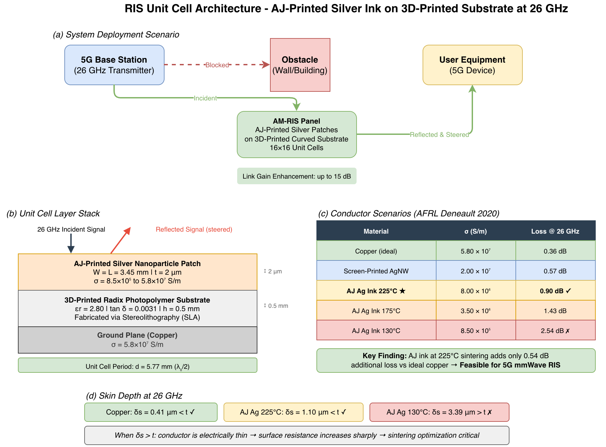
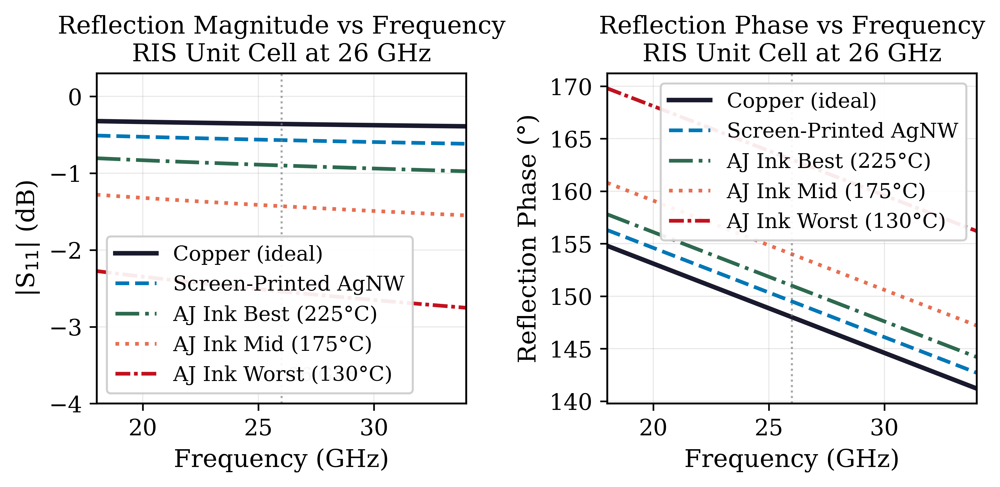
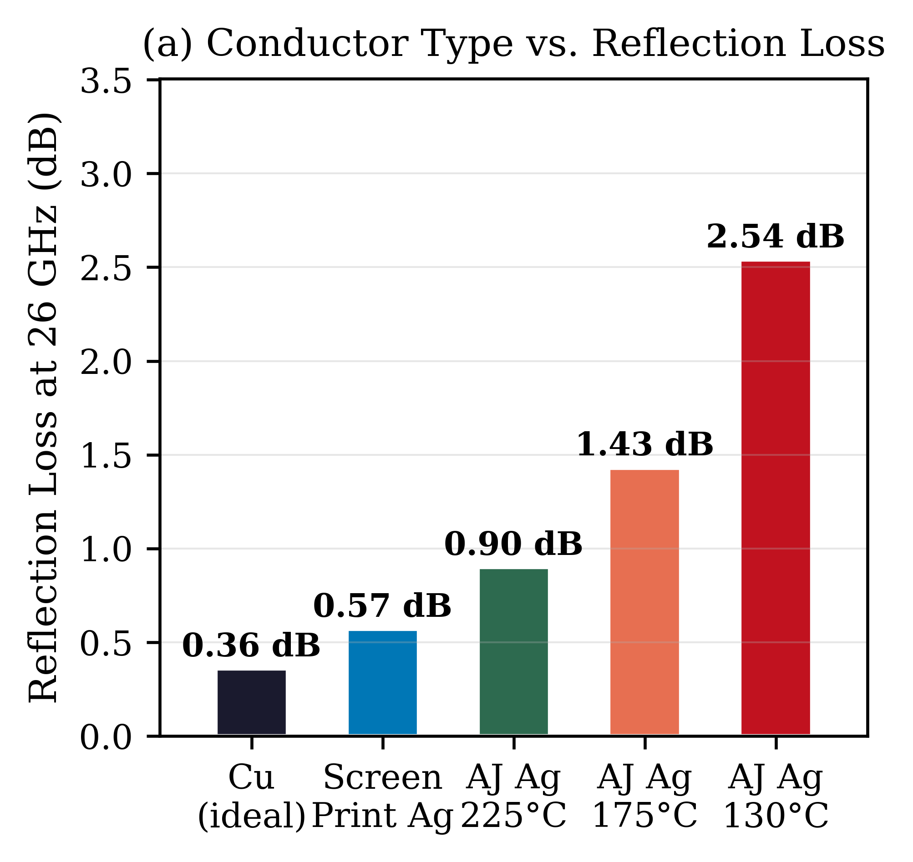
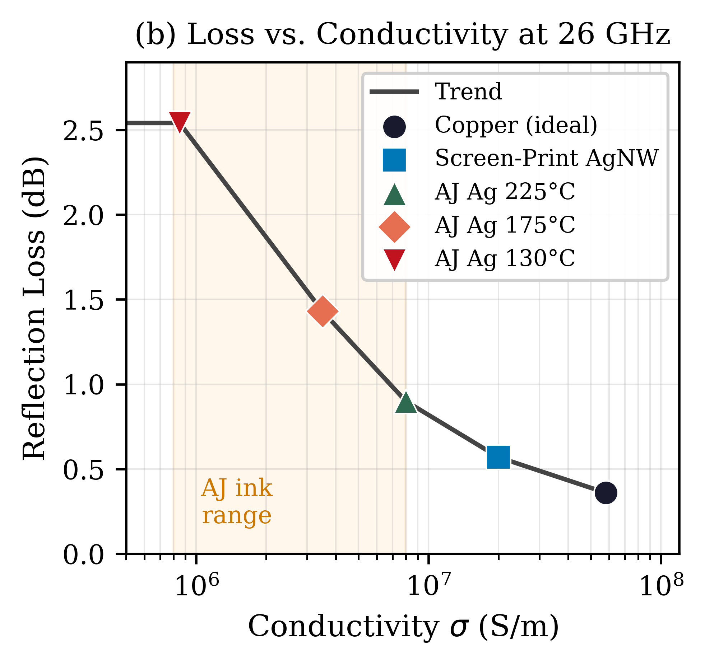
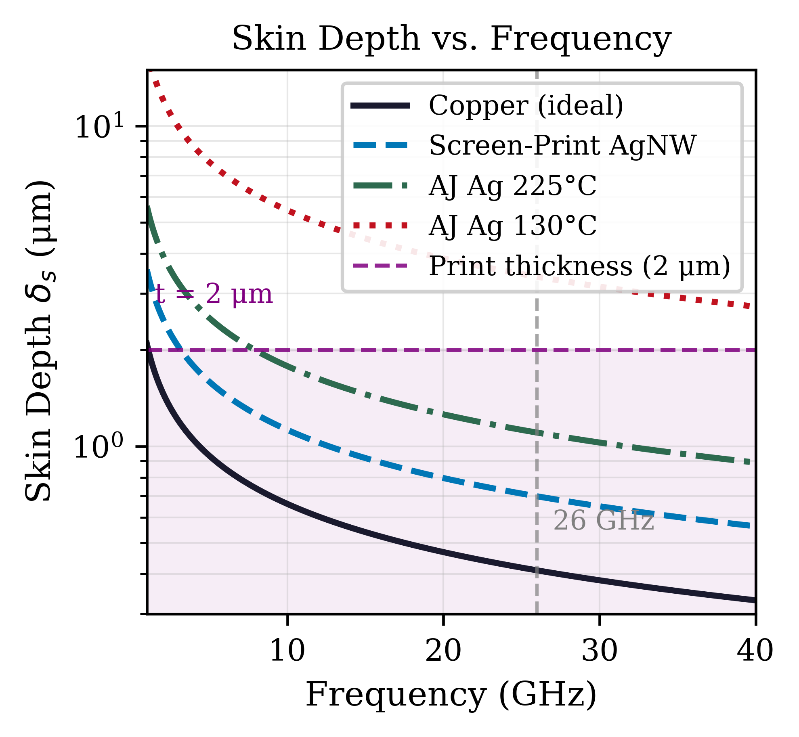

# Aerosol-Jet Printed Silver Nanoparticle RIS Unit Cell Simulation at 26 GHz

[](https://2026-ieee-ames.org/)
[](LICENSE)
[](https://www.python.org/)

## About This Repository

This repository contains the simulation code and results for the paper:

> **Aerosol-Jet Printed Silver Nanoparticle Reconfigurable Intelligent Surfaces for 5G mmWave: Unit Cell Simulation at 26 GHz**
>
> Yogesh Rethinapandian¹, Arunkarthik Sundararajan², Smrithi Prakash³
>
> ¹ Department of Electrical and Computer Engineering, University of Illinois Chicago, USA  
> ² IEEE Member, USA  
> ³ SRM Institute of Science and Technology, Chennai, India
>
> *2nd IEEE International Conference on Additively Manufactured Electronic Systems (IEEE AMES 2026)*  
> *Leuven, Belgium, September 14–15, 2026*

---

## Motivation

Reconfigurable Intelligent Surfaces (RIS) are a key enabling technology for 5G mmWave communications, allowing smart control of signal propagation. Conventional RIS fabrication uses standard PCB processes, which are limited to flat surfaces.

**Aerosol-jet (AJ) printing** enables RIS fabrication on curved, 3D-printed substrates — opening up deployment on building facades, automotive bodywork, and aerospace structures. However, AJ-printed silver inks have lower conductivity than bulk copper, and the impact of this on RIS performance at 26 GHz has never been quantified.

This paper answers the question: **how much performance is lost when you print a 5G RIS with silver ink instead of copper?**

---

## System Architecture



---

## Key Results

| Material | σ (S/m) | Skin Depth at 26 GHz | Reflection Loss | vs Copper |
|---|---|---|---|---|
| Copper (ideal) | 5.80×10⁷ | 0.41 μm | 0.36 dB | baseline |
| Screen-Printed AgNW | 2.00×10⁷ | 0.66 μm | 0.57 dB | +0.21 dB |
| **AJ Ag Ink 225°C** | **8.00×10⁶** | **1.10 μm** | **0.90 dB** | **+0.54 dB ✓** |
| AJ Ag Ink 175°C | 3.50×10⁶ | 1.66 μm | 1.43 dB | +1.07 dB |
| AJ Ag Ink 130°C | 8.50×10⁵ | 3.39 μm | 2.54 dB | +2.18 dB |

**Key finding:** AJ silver ink at optimal sintering (225°C) introduces only **0.54 dB** additional reflection loss vs ideal copper — confirming feasibility for 5G mmWave conformal RIS deployment.

---

## Simulation Results

### Figure 1: Reflection Magnitude and Phase


### Figure 2a: Conductor Loss Comparison


### Figure 2b: Loss vs Conductivity


### Figure 3: Skin Depth Analysis


---

## Repository Structure

```
├── simulation.py                # Main simulation script
├── fig1_reflection.png          # Reflection magnitude and phase
├── fig2a_loss_bar.png           # Conductor loss bar chart
├── fig2b_loss_scatter.png       # Loss vs conductivity scatter
├── fig3_skindepth.png           # Skin depth analysis
├── ris_architecture_drawio.png  # System architecture diagram
├── LICENSE                      # MIT License
└── README.md                    # This file
```

---

## How to Reproduce

### Requirements

```bash
pip install numpy matplotlib scipy
```

Python 3.8 or higher required.

### Run

```bash
git clone https://github.com/iamyogesh2001/AJ-RIS-26GHz-Simulation.git
cd AJ-RIS-26GHz-Simulation
python simulation.py
```

All figures will be saved in the current directory.

---

## Simulation Model

The simulation uses an analytical surface-impedance model:

1. **Skin depth**: δs = √(2/ωμ₀σ)
2. **Finite-thickness correction**: Ct = 1/tanh(t/δs)
3. **Surface resistance**: Rs = Ct/(σ·δs)
4. **Grounded slab impedance**: Zin = jηd·tan(kz·h)
5. **Reflection coefficient** with dielectric and conductor attenuation

Conductivity values from published experimental measurements:
- **AFRL Deneault et al.** (2020) — DOI: 10.1016/j.dib.2020.106331
- **Yang et al.** (2025) — arXiv:2509.05981

---

## Citation

```bibtex
@inproceedings{rethinapandian2026ajris,
  title     = {Aerosol-Jet Printed Silver Nanoparticle Reconfigurable Intelligent 
               Surfaces for 5G mmWave: Unit Cell Simulation at 26 GHz},
  author    = {Rethinapandian, Yogesh and Sundararajan, Arunkarthik and Prakash, Smrithi},
  booktitle = {Proc. 2nd IEEE International Conference on Additively Manufactured 
               Electronic Systems (AMES 2026)},
  year      = {2026},
  address   = {Leuven, Belgium}
}
```

---

## Contact

Yogesh Rethinapandian — yrethi2@uic.edu  
ORCID: [0009-0000-9865-0842](https://orcid.org/0009-0000-9865-0842)  
University of Illinois Chicago, Department of Electrical and Computer Engineering
